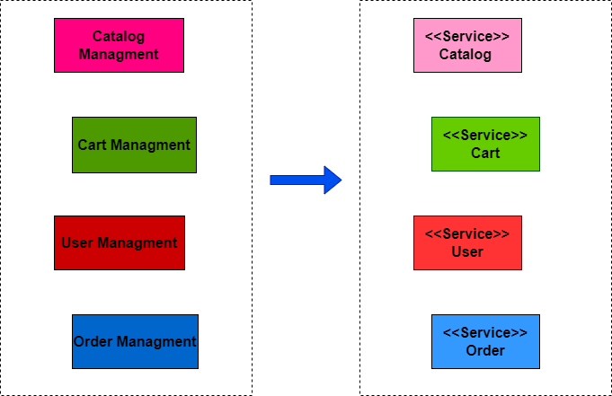

# DEVELOPMENT OF A PROTOTYPE SYSTEM FOR e-COMMERCE BASED ON MICROSSERVICES

This repository is part of my final graduation project that aimed to develop a prototype system for e-commerce based on microservices.

### Problem Description

What requirements are needed to create and develop cloud-native software systems based on microservices architecture?

### Domain Description

The e-commerce application is a software system that acts as part of a set of services that contribute to the availability and access to data that simulate the process of listing, selecting and purchasing products. The application has domains related to the  aspects of e-commerce sales and purchases, such as User domains, Product Catalog, Shopping Cart and Orders.

The proposed architecture intends to decompose the modules of the vision of a monolithic architecture for the architecture of microservices. To do so, first you need to understand which parts of the system behave as a module and can become a microservice. One of the ways is to decompose the domain by its business capacity, and this is how architecture and each microservice follows throughout this work. The Figure 1 shows the decomposition of domains by their business capability.

  

  
Figure 1: Decomposition of domains by business capability

   

Each domain has the following business capabilities as shown in Table 1.

Identifier    | Domain  | Business Capabilities 
-----------   | ------- | :------
BC1           | User    | Responsible for creating, authenticating, searching, editing and removing users.
BC2           | Catalog | Responsible for creating, searching, editing and removing products.
BC3           | Cart    | Responsible for grouping products selected by the user, total quantity of selected products and total cost of selected products.
BC4           | Order   | Module responsible for sending an order confirmation to a user. This module must send the description of each product, quantity of selected products and total cost of selected products in a user's cart.

  
Table 1: Capabilities Responsibilities by Domain.

   

In line with the business responsibilities of each domain, some e-commerce system requirements can be highlighted in Table 2.

Identifier  | Requirements Description
---------   | :------
R1          | The system must register users.
R2          | The system must be able to create products.
R3          | A user can insert products with their respective quantity in the cart.
R4          | A user's shopping cart must contain all products selected by the user, as well as the quantity of the corresponding products and the total cost of the products selected by the user.
R5          | A user can confirm an order and must receive an email with the order information.

  
Table 2: E-commerce system requirements.

   

### Proposed Architecture Prototype

This section presents the proposed microservices architecture whose objective is to support the e-commerce application and its underlying services. In order to achieve the objective of the proposed microservices architecture, some stages of specification and definition of the architecture were established, presented below:
  1. Separation of microservices through domains and their context boundary;
  2. Microservices architecture specification;
  3. Construction of microservices;
  4. DBMS definition;
  5. Communication protocols between services;
  6. Deployment of cloud microservices.

Figure 1 presents an overview of the architecture for developing a prototype of an e-commerce system based on microservices. It briefly presents the objectives, relationships and communication protocols of microservices. It is noteworthy that the proposed architecture represents only an implementational view that is free of runtime environments. The construction of the prototype of this system comprises only the parts related to the microservices, so it will not be detailed nor will the user interaction system interface be developed.

  
  
    
Figure 2: Overview of the architecture for developing a prototype system for e-commerce based on microservices.

     

### Continuous Delivery

Once all the services were implemented, it was necessary to create the continuous delivery process in order to automate changes to the repositories of the e-commerce system microservices and the application of these changes to the cloud environment. The Figure 3 shows the continuous delivery workflow for microservices using GitHub and GitHub Actions.

  

  
Figure 3: Continuous delivery workflow for microservices using GitHub and GitHub Actions.

   

### Cloud e-commerce system prototype

With all the provisioning and deployment steps completed, it is possible to use the prototype of the e-commerce system as a functional and fully available application. The Figure 4, presents the overview of the prototype of the e-commerce system using cloud services.

  

  
Figure 4: Overview of prototype e-commerce system using cloud services.

   

Technologies
NodeJS, Express, Python, gRPC, SMTP, Docker, Kubernetes, Github Actions, C4 Model, Google Cloud Platform (GCP), Google Cloud SQL, Google Kubernetes Engine(GKE), Google Cloud Client Libraries, Google Cloud PubSub, MongoDB Atlas.
